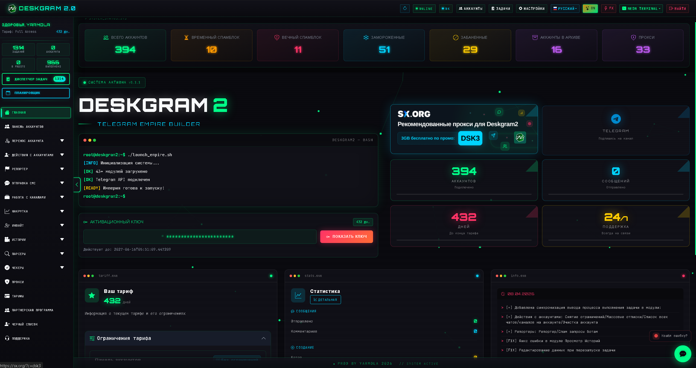
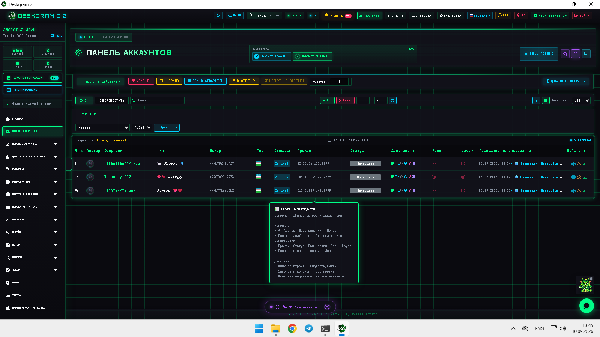
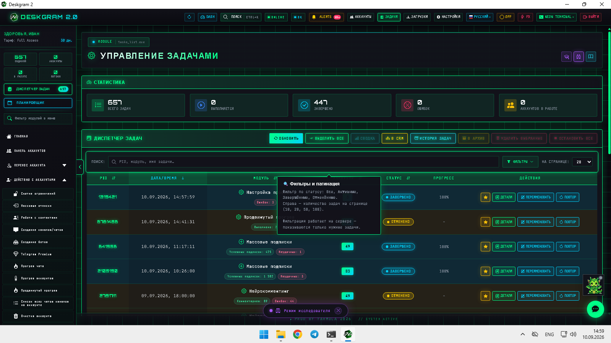
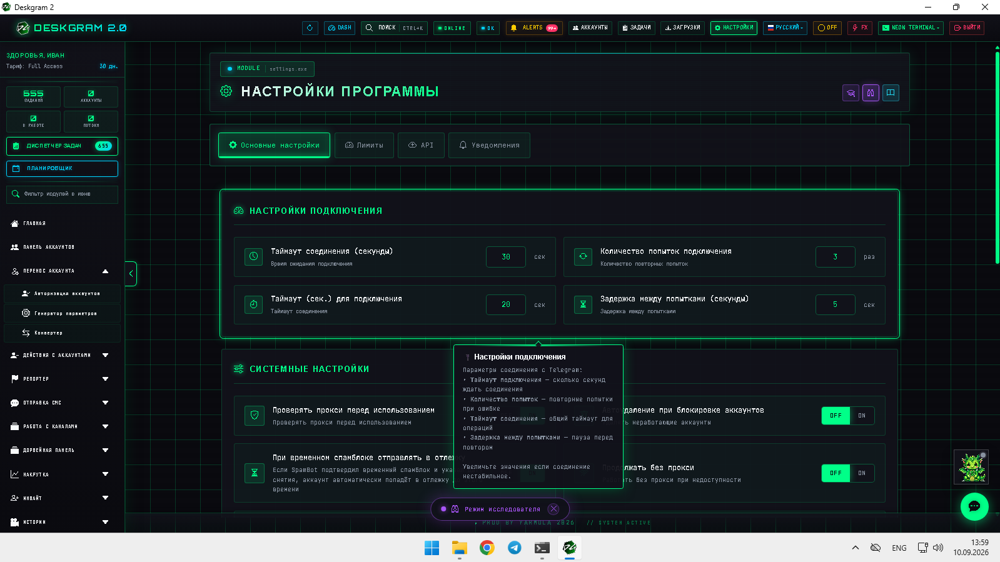

# Deskgram 2 для Telegram-автоматизации

Deskgram 2 — это платформа для автоматизации действий в Telegram: управления аккаунтами, массовых коммуникаций, AI-сценариев, парсинга аудитории, инвайта и инфраструктурной подготовки рабочих сеток аккаунтов. Этот репозиторий играет роль главного хаба и ведет в узкие гайды по конкретным модулям.

[Официальный сайт](https://deskgram2.com/) · [Telegram-бот](https://t.me/DG2welcomebot) · [Web preview](https://deskgram2.com/web-preview) · [Преимущества](https://deskgram2.com/advantages)
## Интерактивный Web Preview

Попробовать модуль в браузере: [Открыть веб-превью](https://deskgram2.com/web-preview?path=%2Fapp-demo%2Fhome)

## Почему это удобно

| Что нужно руками | Что дает Deskgram 2 |
|---|---|
| Держать в голове десятки отдельных действий | Работать через единый интерфейс |
| Вести аккаунты, прокси и лимиты в разных местах | Управлять инфраструктурой централизованно |
| Разносить сценарии по разным софтам и таблицам | Запускать рассылки, парсинг, AI и инвайт в одной системе |
| Терять логи и статусы по задачам | Видеть статистику, терминал и историю выполнения |
| Сложно масштабировать потоки | Управлять многопоточностью и лимитами из интерфейса |

## Что можно автоматизировать

| Сценарий | Подходящие модули | Что получаете на выходе |
|---|---|---|
| AI-комментирование постов | Нейрокомментинг | Автоматические комментарии по новым публикациям |
| Массовая отправка сообщений в ЛС | Рассылка в ЛС | Поточные личные рассылки с лимитами и AI |
| Подготовка базы пользователей | Сбор аудитории | Парсинг и экспорт аудитории из чатов и групп |
| Рост чатов и каналов через приглашения | Инвайт | Инвайт по заранее собранной базе |
| Подготовка инфраструктуры под задачи | Панель аккаунтов, Прокси и Настройки | Рабочая база прокси, аккаунтов и системных параметров |

## Кому подойдет

- командам Telegram-маркетинга;
- владельцам каналов и сеток аккаунтов;
- специалистам по лидогенерации;
- операторам Telegram-автоматизации;
- тем, кто хочет соединить AI, рассылки и парсинг в одном рабочем контуре.

## Визуально внутри программы

## Ключевые гайды по сценариям

- [Нейрокомментинг](https://github.com/Deskgram-2/telegram-neuro-commenting-deskgram)
- [Рассылка в ЛС](https://github.com/Deskgram-2/telegram-direct-messaging-deskgram)
- [Сбор аудитории](https://github.com/Deskgram-2/telegram-audience-parser-deskgram)
- [Массовые подписки](https://github.com/Deskgram-2/telegram-join-groups-deskgram)
- [Инвайт](https://github.com/Deskgram-2/telegram-invite-tool-deskgram)

## Инфраструктурные и системные гайды

- [Панель аккаунтов](https://github.com/Deskgram-2/telegram-account-manager-deskgram)
- [Диспетчер задач](https://github.com/Deskgram-2/telegram-task-manager-deskgram)
- [Управление прокси](https://github.com/Deskgram-2/telegram-proxy-manager-deskgram)
- [Настройки автоматизации](https://github.com/Deskgram-2/telegram-automation-settings-deskgram)

## AI и коммуникационные гайды

- [Нейрорассылка](https://github.com/Deskgram-2/telegram-neuro-mailing-deskgram)
- [Нейрочаттинг](https://github.com/Deskgram-2/telegram-neuro-chatting-deskgram)
- [Автоответчик](https://github.com/Deskgram-2/telegram-autoresponder-deskgram)

## Discovery и growth-гайды

- [Поиск каналов и групп](https://github.com/Deskgram-2/telegram-channel-search-deskgram)
- [Поиск похожих каналов](https://github.com/Deskgram-2/telegram-similar-channels-deskgram)
- [Сбор аудитории из комментариев](https://github.com/Deskgram-2/telegram-comment-audience-parser-deskgram)
- [Сбор писавших в чатах](https://github.com/Deskgram-2/telegram-active-chat-users-parser-deskgram)

## Подготовка и развертывание инфраструктуры

- [Прогрев аккаунтов](https://github.com/Deskgram-2/telegram-account-warmup-deskgram)
- [Создание каналов и групп](https://github.com/Deskgram-2/telegram-channel-creator-deskgram)
- [Создание ботов](https://github.com/Deskgram-2/telegram-bot-creator-deskgram)

## Готовые связки по шагам

- [Панель аккаунтов](https://github.com/Deskgram-2/telegram-account-manager-deskgram) -> [Прокси](https://github.com/Deskgram-2/telegram-proxy-manager-deskgram) -> [Настройки](https://github.com/Deskgram-2/telegram-automation-settings-deskgram) -> [Сбор аудитории](https://github.com/Deskgram-2/telegram-audience-parser-deskgram) -> [Рассылка в ЛС](https://github.com/Deskgram-2/telegram-direct-messaging-deskgram)
- [Панель аккаунтов](https://github.com/Deskgram-2/telegram-account-manager-deskgram) -> [Прокси](https://github.com/Deskgram-2/telegram-proxy-manager-deskgram) -> [Массовые подписки](https://github.com/Deskgram-2/telegram-join-groups-deskgram) -> [Инвайт](https://github.com/Deskgram-2/telegram-invite-tool-deskgram)
- [Настройки автоматизации](https://github.com/Deskgram-2/telegram-automation-settings-deskgram) -> [Нейрокомментинг](https://github.com/Deskgram-2/telegram-neuro-commenting-deskgram) -> [Диспетчер задач](https://github.com/Deskgram-2/telegram-task-manager-deskgram)
- [Сбор аудитории](https://github.com/Deskgram-2/telegram-audience-parser-deskgram) -> [Нейрорассылка](https://github.com/Deskgram-2/telegram-neuro-mailing-deskgram) -> [Автоответчик](https://github.com/Deskgram-2/telegram-autoresponder-deskgram) -> [Диспетчер задач](https://github.com/Deskgram-2/telegram-task-manager-deskgram)
- [Поиск каналов и групп](https://github.com/Deskgram-2/telegram-channel-search-deskgram) -> [Поиск похожих каналов](https://github.com/Deskgram-2/telegram-similar-channels-deskgram) -> [Сбор аудитории из комментариев](https://github.com/Deskgram-2/telegram-comment-audience-parser-deskgram) -> [Рассылка в ЛС](https://github.com/Deskgram-2/telegram-direct-messaging-deskgram)
- [Прогрев аккаунтов](https://github.com/Deskgram-2/telegram-account-warmup-deskgram) -> [Массовые подписки](https://github.com/Deskgram-2/telegram-join-groups-deskgram) -> [Нейрокомментинг](https://github.com/Deskgram-2/telegram-neuro-commenting-deskgram) -> [Нейрочаттинг](https://github.com/Deskgram-2/telegram-neuro-chatting-deskgram)
- [Панель аккаунтов](https://github.com/Deskgram-2/telegram-account-manager-deskgram) -> [Создание каналов и групп](https://github.com/Deskgram-2/telegram-channel-creator-deskgram) -> [Создание ботов](https://github.com/Deskgram-2/telegram-bot-creator-deskgram) -> [Инвайт](https://github.com/Deskgram-2/telegram-invite-tool-deskgram)

## Как выбрать первый модуль под задачу

| Если у вас такая цель | С чего лучше начать |
|---|---|
| Нужна база пользователей | [Сбор аудитории](https://github.com/Deskgram-2/telegram-audience-parser-deskgram) |
| Нужен личный outreach | [Рассылка в ЛС](https://github.com/Deskgram-2/telegram-direct-messaging-deskgram) |
| Нужен рост группы или канала | [Инвайт](https://github.com/Deskgram-2/telegram-invite-tool-deskgram) |
| Нужна AI-активность под постами | [Нейрокомментинг](https://github.com/Deskgram-2/telegram-neuro-commenting-deskgram) |
| Нужна подготовка аккаунтов и среды | [Панель аккаунтов](https://github.com/Deskgram-2/telegram-account-manager-deskgram) + [Прокси](https://github.com/Deskgram-2/telegram-proxy-manager-deskgram) |
| Нужен stories-сценарий | [Отметки в сторис](https://github.com/Deskgram-2/telegram-story-mentions-deskgram) или [Просмотр сторис](https://github.com/Deskgram-2/telegram-story-viewer-deskgram) |
| Нужна работа с каналами как контентной сеткой | [Рассылка постов по каналам](https://github.com/Deskgram-2/telegram-channel-posting-deskgram) |

## Что выбрать: похожие сценарии без путаницы

| Если выбор между этими задачами | Что лучше брать |
|---|---|
| Личный контакт или рост сообщества | [Рассылка в ЛС](https://github.com/Deskgram-2/telegram-direct-messaging-deskgram) для диалога, [Инвайт](https://github.com/Deskgram-2/telegram-invite-tool-deskgram) для роста группы |
| Поиск площадок или сбор пользователей | [Поиск каналов и групп](https://github.com/Deskgram-2/telegram-channel-search-deskgram) для discovery, [Сбор аудитории](https://github.com/Deskgram-2/telegram-audience-parser-deskgram) для базы пользователей |
| Комментирование с AI или более шаблонный comments-flow | [Нейрокомментинг](https://github.com/Deskgram-2/telegram-neuro-commenting-deskgram) для более живого текста, [Комментирование](https://github.com/Deskgram-2/telegram-comment-campaigns-deskgram) для более прямой comments-кампании |
| Публикация stories или просмотры stories | [Отметки в сторис](https://github.com/Deskgram-2/telegram-story-mentions-deskgram) для публикации, [Просмотр сторис](https://github.com/Deskgram-2/telegram-story-viewer-deskgram) для activity-слоя |
| Массовые подписки или инвайт | [Массовые подписки](https://github.com/Deskgram-2/telegram-join-groups-deskgram) для подключения своих аккаунтов к среде, [Инвайт](https://github.com/Deskgram-2/telegram-invite-tool-deskgram) для добавления внешних пользователей |

## Что выбрать для первого результата

| Если вы хотите получить первый практический результат | Лучше идти так |
|---|---|
| Быстро собрать базу и начать личный outreach | [Сбор аудитории](https://github.com/Deskgram-2/telegram-audience-parser-deskgram) -> [Рассылка в ЛС](https://github.com/Deskgram-2/telegram-direct-messaging-deskgram) |
| Зайти в growth через сообщества и окружение | [Массовые подписки](https://github.com/Deskgram-2/telegram-join-groups-deskgram) -> [Инвайт](https://github.com/Deskgram-2/telegram-invite-tool-deskgram) |
| Получить AI-активность и engagement под постами | [Настройки автоматизации](https://github.com/Deskgram-2/telegram-automation-settings-deskgram) -> [Нейрокомментинг](https://github.com/Deskgram-2/telegram-neuro-commenting-deskgram) |
| Сначала собрать базовую инфраструктуру без активных запусков | [Панель аккаунтов](https://github.com/Deskgram-2/telegram-account-manager-deskgram) -> [Прокси](https://github.com/Deskgram-2/telegram-proxy-manager-deskgram) -> [Настройки автоматизации](https://github.com/Deskgram-2/telegram-automation-settings-deskgram) |

## Быстрый старт

1. Добавьте Telegram-аккаунты в систему.
2. При необходимости привяжите и проверьте прокси.
3. Настройте системные параметры и AI-провайдеров.
4. Выберите модуль под нужный сценарий.
5. Задайте лимиты, задержки, фильтры и запустите задачу.
6. Контролируйте логи, статистику и итоговый результат.

## Рекомендуемый путь по модулям

1. [Панель аккаунтов](https://github.com/Deskgram-2/telegram-account-manager-deskgram) — завести и проверить аккаунты.
2. [Прокси](https://github.com/Deskgram-2/telegram-proxy-manager-deskgram) — подготовить рабочий пул.
3. [Настройки](https://github.com/Deskgram-2/telegram-automation-settings-deskgram) — подключить ключи и системные параметры.
4. [Сбор аудитории](https://github.com/Deskgram-2/telegram-audience-parser-deskgram) или [Массовые подписки](https://github.com/Deskgram-2/telegram-join-groups-deskgram) — подготовить базу и окружение.
5. [Рассылка в ЛС](https://github.com/Deskgram-2/telegram-direct-messaging-deskgram) или [Инвайт](https://github.com/Deskgram-2/telegram-invite-tool-deskgram) — использовать базу в сценарии роста.
6. [Нейрокомментинг](https://github.com/Deskgram-2/telegram-neuro-commenting-deskgram) — подключить AI-активности для каналов.
7. [Диспетчер задач](https://github.com/Deskgram-2/telegram-task-manager-deskgram) — контролировать статусы и результаты.

## FAQ

### Это один модуль или целая система?

Это система из нескольких модулей. Главный репозиторий нужен как точка входа: он объясняет продукт и направляет в более узкие гайды.

### Какие разделы особенно важны на старте?

Обычно стартовый путь выглядит так: Панель аккаунтов -> Прокси -> Настройки -> нужный модуль -> Задачи.

### Есть ли AI-сценарии внутри Deskgram 2?

Да. В проекте уже есть AI-модули и связанные настройки для генерации комментариев, сообщений и ответов.

### Что есть в этом репозитории?

Это обзорная точка входа в Deskgram 2. Здесь собраны базовые сценарии использования, краткое описание платформы и ссылки на отдельные гайды по ключевым модулям.

## FAQ по стартовым сценариям

### С чего лучше начинать, если еще нет базы пользователей?

Чаще всего лучший путь такой: сначала подготовить аккаунты и инфраструктуру, потом выбрать либо [сбор аудитории](https://github.com/Deskgram-2/telegram-audience-parser-deskgram), либо [массовые подписки](https://github.com/Deskgram-2/telegram-join-groups-deskgram), в зависимости от того, нужен ли вам сначала список пользователей или среда для дальнейшей активности.

### Какой маршрут обычно дает самый быстрый первый результат?

Обычно самый быстрый прикладной результат дает связка [сбор аудитории](https://github.com/Deskgram-2/telegram-audience-parser-deskgram) -> [рассылка в ЛС](https://github.com/Deskgram-2/telegram-direct-messaging-deskgram), потому что она быстрее всего превращает подготовленную базу в измеримый outreach-сценарий.

### Если AI пока не нужен, Deskgram 2 все равно подходит?

Да. AI — это только часть системы. Базовые маршруты вроде инфраструктуры, парсинга, инвайта, подписок и обычной рассылки спокойно работают и без AI-слоя.

## Полезные ссылки

- [Сайт Deskgram 2](https://deskgram2.com/)
- [Telegram-бот Deskgram 2](https://t.me/DG2welcomebot)
- [Web preview](https://deskgram2.com/web-preview)
- [Преимущества Deskgram 2](https://deskgram2.com/advantages)
